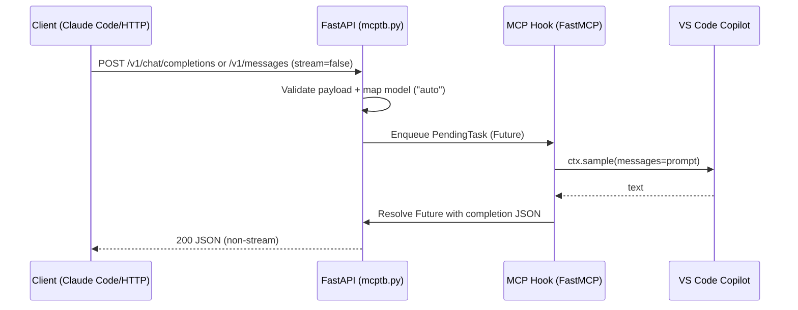
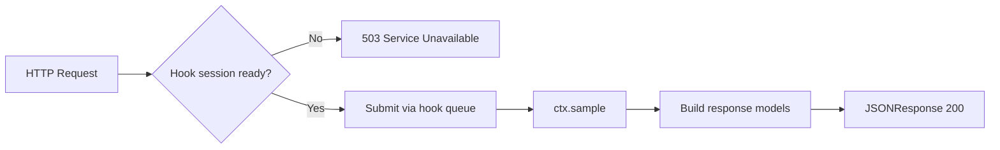

# MCPTokenBridge

## Overview (English)
MCPTokenBridge is a single-file Python bridge that simultaneously runs an OpenAI-compatible `/v1/chat/completions` HTTP endpoint (FastAPI + uvicorn) and a stdin-based MCP tool named `hook`. The `hook` worker thread never stops; it drains an internal queue so web requests are forwarded to MCP and returned with `X-MCP-*` headers. The process has only one entrypoint and starts both services together.

## 概览（中文）
MCPTokenBridge 是一个单文件的 Python 桥接程序，同时运行 OpenAI 风格的 `/v1/chat/completions` HTTP 接口（FastAPI + uvicorn）和基于 STDIN 的 MCP 工具 `hook`。`hook` 工作者线程常驻，持续从队列中取出请求并返回带有 `X-MCP-*` 头的结果；整个流程只有一个入口，启动即同时运行两种服务。

## Getting Started / 快速开始
```bash
python -m venv .venv
source .venv/bin/activate
pip install -r requirements.txt
```

## Run: single entry (HTTP + MCP) / 运行方式：单一入口（HTTP + MCP）
```bash
python mcptb.py --host 0.0.0.0 --port 8000
# MCP stdin is handled on the same process; for example:
echo '{"jsonrpc":"2.0","id":1,"method":"initialize"}' | python mcptb.py --host 0.0.0.0 --port 8000
```

## Network binding guidance / 网络绑定说明
- **English**: Use `--host 0.0.0.0` when you want every network adapter (e.g., `192.168.55.10:8888` and `192.168.1.11:8888`) to be reachable on the same port. Use a specific host (e.g., `--host 192.168.55.10 --port 8888`) to bind only that adapter; other adapters will not accept connections.
- **中文**：当需要让所有网卡（例如 `192.168.55.10:8888` 与 `192.168.1.11:8888`）都可访问时，使用 `--host 0.0.0.0`。若只想绑定某个适配器，请指定具体地址（如 `--host 192.168.55.10 --port 8888`）；此时其他适配器将无法访问。

## Architecture Diagram / 架构图





## Human Workflow / 人类操作流程

1. 启动具备订阅的智能体（例如 VS Code GitHub Copilot）。
  - Ensure Copilot is active in VS Code; login and subscription required.
2. 启动 MCP 并允许 `hook` 被调用。
  - Provide an `mcp.json` entry that runs `python mcptb.py --host 0.0.0.0 --port 8000`; the `hook` warms up and marks the session ready.
3. 在对话中调用 MCP `hook`，例如输入 “hi”，完成转向与就绪检测。
  - Copilot Chat → call MCP `hook` with simple input to confirm the bridge is responsive.
4. 启动 Claude Code，访问公开端口并进行非流式请求。
  - Point `ANTHROPIC_BASE_URL` to `http://<windows-ip>:8000` and run the CLI; the bridge returns non-stream JSON.


## Flow (English)
1. HTTP `POST /v1/chat/completions` enqueues the request and waits for the `hook` worker reply.
2. The `hook` tool never terminates; it runs on a fixed background thread and returns MCP headers along with the chat response.
3. **Streaming enabled**: `stream=true` requests push SSE chunks while the bridge aggregates the full answer for terminal TX logging.

## 工作流（中文）
1. HTTP `POST /v1/chat/completions` 会将请求入队，等待 `hook` 工作者返回结果。
2. `hook` 工具常驻后台线程，不会结束，同时返回 MCP 相关的响应头与聊天内容。
3. **流式开启**：`stream=true` 请求使用 SSE 按片段推送，桥接器会在日志中汇总完整内容。

## Project Layout / 目录结构
- `mcptb.py` — single runtime module for both HTTP and MCP modes / 兼作 HTTP 与 MCP 入口的单文件模块
- `requirements.txt` — dependencies / 依赖声明
- `tests/` — pytest suite / 单元测试
- `logs/`, `bin/` — outputs and helper scripts / 输出与辅助脚本

## Endpoints & Examples / 接口与示例

### Non-streaming request (traditional) / 非流式请求（传统）
```bash
curl -X POST http://127.0.0.1:8000/v1/chat/completions \
  -H "Content-Type: application/json" \
  -d '{
    "model": "mcp-bridge-demo",
    "messages": [{"role": "user", "content": "Hello!"}],
    "stream": false
  }'
# Response: {"id":"mcp-fastmcp-response","model":"mcp-bridge-demo","object":"chat.completion",...}
```


## VS Code MCP configuration (English)
Place `mcp.json` under `.vscode/` (or your global MCP directory) so Copilot Chat launches the combined entrypoint and keeps `hook` alive:
```json
{
  "mcpServers": {
    "mcp-token-bridge": {
      "command": "python",
      "args": ["mcptb.py", "--host", "127.0.0.1", "--port", "8000"],
      "env": {},
      "enabled": true
    }
  }
}
```
- Ensure `python` points to your virtual environment; the MCP stdin server and HTTP server start together on the specified host/port.
- Keep the process running; the `hook` tool never terminates and forwards all chat completions through the queue.

## VS Code MCP 配置（中文）
在 `.vscode/`（或全局 MCP 目录）下放置 `mcp.json`，让 Copilot Chat 启动组合入口并保持 `hook` 持续运行：
```json
{
  "mcpServers": {
    "mcp-token-bridge": {
      "command": "python",
      "args": ["mcptb.py", "--host", "127.0.0.1", "--port", "8000"],
      "env": {},
      "enabled": true
    }
  }
}
```
- 确认 `python` 指向虚拟环境；MCP stdin 与 HTTP 服务器会在指定的主机和端口同时启动。
- 进程需保持常驻；`hook` 工具不会结束，所有 Chat Completion 请求都会通过后台队列转发。

---

## Streaming Support / 流式支持
- **English**: `stream=true` returns Server-Sent Events (OpenAI-style `data:` lines or Anthropic message events). Each request is tagged with a GUID so RX/TX logs can be correlated. The hook emits fragments via per-request queues and the bridge logs the final assembled text when the stream ends.
- **中文**：设置 `stream=true` 时返回 SSE（OpenAI 风格的 `data:` 行或 Anthropic 事件序列）。每个请求都有 GUID 方便在日志中对齐 RX/TX，hook 按队列输出片段，流结束时桥接器会记录完整文本。

## Endpoints & Examples / 接口与示例

### OpenAI non-stream / OpenAI 非流式
```bash
curl -X POST http://127.0.0.1:8000/v1/chat/completions \
  -H "Content-Type: application/json" \
  -d '{
    "model": "auto",
    "messages": [{"role": "user", "content": "Hello!"}],
    "stream": false
  }'
```

### OpenAI streaming / OpenAI 流式
```bash
curl -N -X POST http://127.0.0.1:8000/v1/chat/completions \
  -H "Content-Type: application/json" \
  -d '{
    "model": "auto",
    "messages": [{"role": "user", "content": "Stream please"}],
    "stream": true
  }'
# Receives SSE lines such as: data: {"choices":[{"delta":{"role":"assistant","content":"..."}}]}
```

### Anthropic non-stream / Anthropic 非流式
```bash
curl -X POST http://127.0.0.1:8000/v1/messages \
  -H "Content-Type: application/json" \
  -d '{
    "model": "auto",
    "messages": [{"role": "user", "content": "Hello!"}],
    "stream": false
  }'
```

### Anthropic streaming / Anthropic 流式
```bash
curl -N -X POST http://127.0.0.1:8000/v1/messages \
  -H "Content-Type: application/json" \
  -d '{
    "model": "auto",
    "messages": [{"role": "user", "content": "Stream please"}],
    "stream": true
  }'
# Emits Anthropic event frames: message_start, content_block_delta, message_stop, [DONE]
```

## Timeouts / 超时
- Server-side per-request timeout is configurable via `MCPTB_HTTP_TIMEOUT` (seconds). Use `none`/`0`/`infinite` for no timeout.
- 服务器端每次请求的等待时间可通过 `MCPTB_HTTP_TIMEOUT` 设置（秒）。使用 `none`/`0`/`infinite` 关闭超时。

## WSL2 → Windows access / WSL2 访问 Windows 服务
- From WSL2, discover Windows host IP: `ip route | awk '/default/ {print $3}'` or `grep nameserver /etc/resolv.conf | awk '{print $2}'`.
- Use `http://<windows-ip>:8000` to call the bridge from WSL2.

## Claude Code (WSL2) example / 示例
```bash
#!/usr/bin/env bash
set -euo pipefail

export ANTHROPIC_AUTH_TOKEN="no-need-but-placeholder"
export ANTHROPIC_MODEL="local-vscode-copilot"
export ANTHROPIC_BASE_URL="http://<windows-ip>:8000"  # exposes /v1/messages

echo "[Claude Code/WSL] Using gateway: $ANTHROPIC_BASE_URL"

mkdir -p "$HOME/.npm-global/lib"
npm config set prefix "$HOME/.npm-global" >/dev/null 2>&1 || true

if command -v claude >/dev/null 2>&1; then
  claude "$@" --dangerously-skip-permissions
else
  npx -y @anthropic-ai/claude-code "$@"
fi
```
